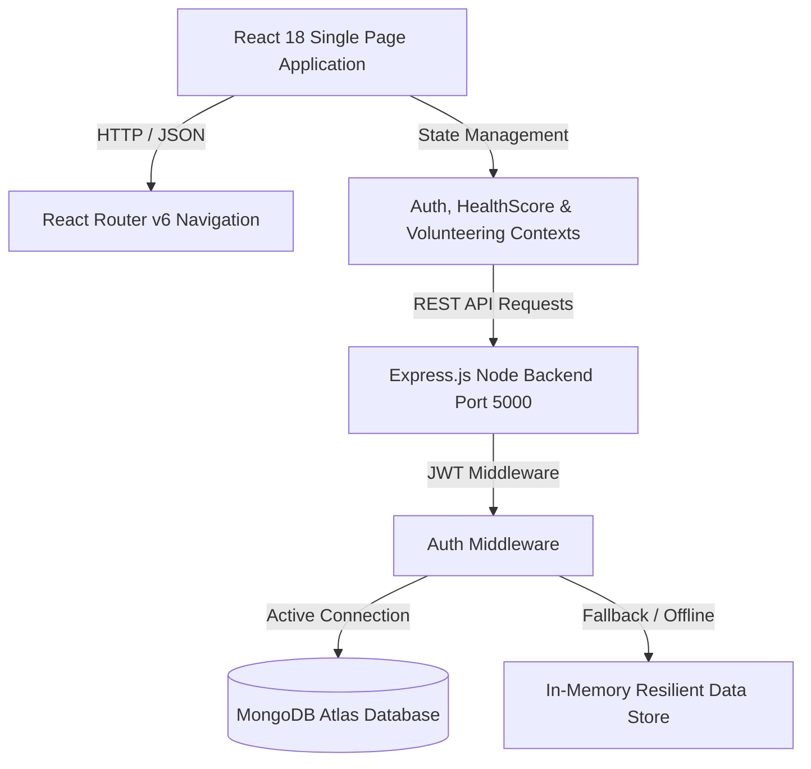

# 📐 System Architecture & Design Documentation

## 1. System Overview

The **WHO Global Surveillance & Health Hub** is engineered as a decoupled, multi-tier web application designed for high availability, fault tolerance, and rich user interaction.



---

## 2. Key Architectural Decisions

### 2.1 Resilient Dual-Mode Data Persistence
- **Primary**: MongoDB Atlas via Mongoose ORM.
- **Fallback**: In-Memory Store (`memoryUsers`, `memoryScores`, `memoryVolunteering`).
- **Rationale**: Ensures that database connectivity issues, DNS failures, or sandbox network restrictions never break user registration, authentication, or score tracking.

### 2.2 Global State Management
- **Context API & Reducers**: State is organized into three clean domain contexts:
  - `AuthContext`: Manages JWT tokens, user profiles, login/logout status.
  - `HealthScoreContext`: Manages diagnostic quiz score history and chart telemetry.
  - `VolunteeringContext`: Manages volunteer campaign applications and logged service hours.

### 2.3 Fixed-Bounds Grid Design System
- **Static Form Containers**: The Health Predictor quiz container uses fixed CSS Grid dimensions (`grid-template-columns: 1fr 280px`, `height: 440px`), eliminating layout shifting across question steps.
- **Unified Navigation Header**: Global `<Navbar />` rendered at root router level ensures consistent branding across all pages.

---

## 3. Data Schema Specifications

### User Schema (`models/User.js`)
```javascript
{
  name: { type: String, required: true },
  email: { type: String, required: true, unique: true },
  password: { type: String, required: true },
  date: { type: Date, default: Date.now }
}
```

### Health Score Schema (`models/HealthScore.js`)
```javascript
{
  user: { type: Schema.Types.ObjectId, ref: 'users' },
  score: { type: Number, required: true },
  answers: { type: Object, required: true },
  date: { type: Date, default: Date.now }
}
```

### Volunteering Schema (`models/Volunteering.js`)
```javascript
{
  user: { type: Schema.Types.ObjectId, ref: 'users' },
  project: { type: String, required: true },
  hours: { type: Number, required: true },
  description: { type: String },
  date: { type: Date, default: Date.now }
}
```
